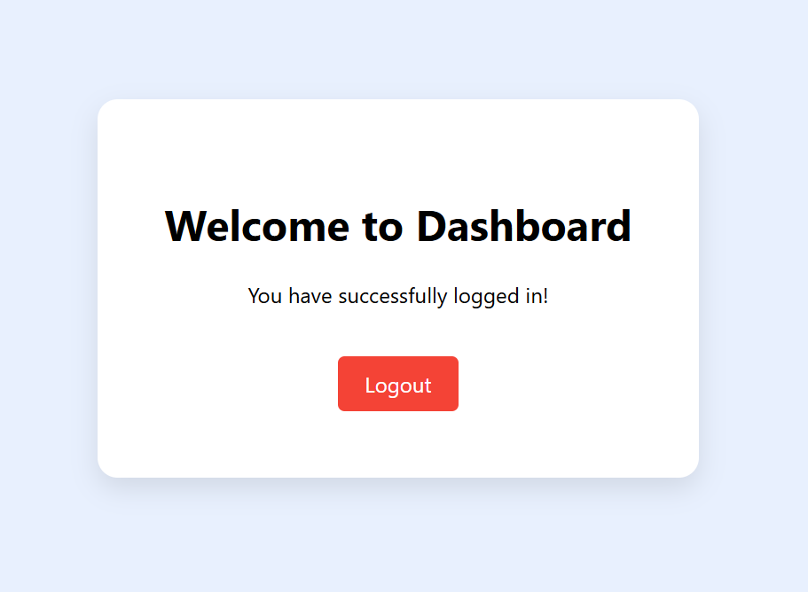
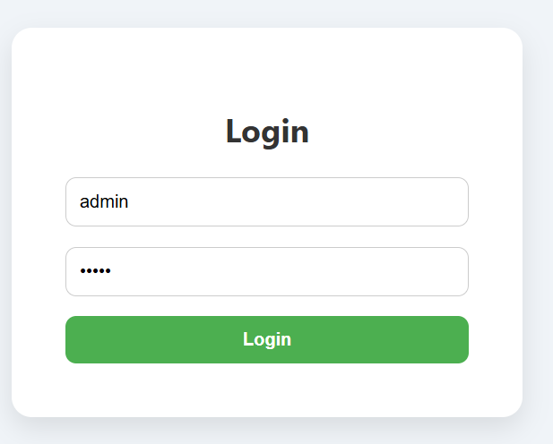

# Experiment 13: Redirect User to Another Page After Login

## Screenshots

Here’s a preview of the app:




## 🎯 Objective
To implement **redirecting users** in React Router after a successful login.

---

## 🛠️ Steps Followed

1. **Created React App**
   ```bash
   npx create-react-app react-router-redirect
   cd react-router-redirect
